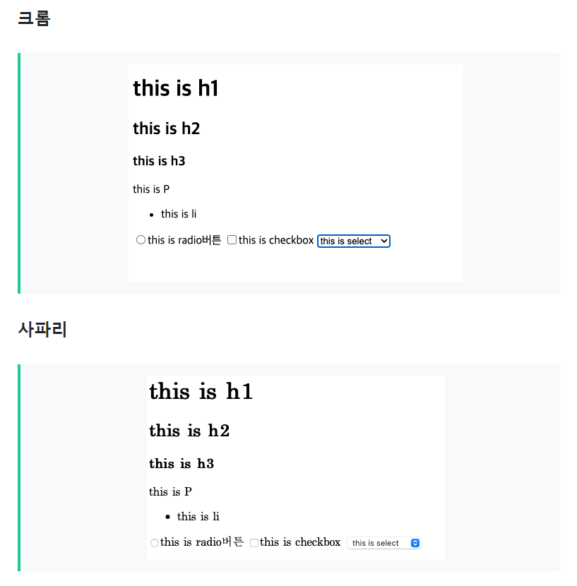

# 1. Reset CSS
## 1-1. 브라우저의 기본 스타일
  
- 각 브라우저는 고유의 기본 스타일을 보유 
    - 스타일링을 따로 하지 않은 HTML일지라도 최소한의 형태를 보장 가능
- 모든 브라우저의 기본 스타일은 조금씩 상이하며, 이를 통일하지 않고 CSS를 생성 시 브라우저마다 의도한 대로 동작하지 않는 문제가 발생 가능
    - 해결 : 베이스 스타일을 정의
    - Hard Reset / Nomalize

## 1-2. Hard Reset 계열 CSS
```
[HTML5 Doctor Reset CSS] 
http://html5doctor.com/html-5-reset-stylesheet/

[css-wipe]
https://github.com/stackcss/css-wipe

[Reset CSS(Eric Meyer's CSS reset)]
http://meyerweb.com/eric/tools/css/reset/

[Tinyreset-tiny CSS reset for the modern web]
https://github.com/shankariyerr/tinyreset
```
- margin, padding, li 등의 모든 스타일을 0으로 초기화
- 브라우저의 기본 스타일을 활용하지 않는 프로젝트에 적합

## 1-3. Nomalize 계열 CSS
```
[Normalize.css]
http://necolas.github.io/normalize.css/

[Sanitize.css]
https://github.com/csstools/sanitize.css
```
- 2011년에 Hard Reset 계열의 CSS를 대체하기 위해 등장
- 브라우저 간 차이나 버그를 제거하며 유용한 기본 스타일은 그대로 활용
    - 브라우저의 기본 스타일에 가까운 형태로 스타일을 정의 가능
- 브라우저의 기본 스타일을 많이 활용하는 프로젝트에 적합

## 1-4. Reset CSS 사용시 주의점
- 잘못된 선택을 할 경우 모듈 작성 시 코드 길이와 개발 비용이 증가
- 진행 중 다른 계열로 변경 시 모듈 훼손 가능

<br>

# 2. 작명 규칙
```js
/*
    1. Hypen Case(Kebab Case)
    - 각 단어를 하이픈(-)으로 연결
*/
    const my-value;
/*
    2. Snake Case
    - 각 단어를 언더스코어(_)로 연결
*/
    const my_value;
/*
    3. Camel Case
    - 두 번째 이후의 첫 문자를 대문자로 표기
*/
    const myValue;
/*
    4. Pascal Case
    - 모든 영단어의 첫 문자를 대문자로 표기
*/
    const MyValue;
```

<br>

# 3. 좋은 CSS를 위한 설계 목표 4가지
```
1. 예측 가능
- 스타일링이 의도한 대로 동작하는지 / 스타일링 영향 범위를 예측 가능한지
- 새로운 스타일을 추가 or 기존 스타일을 수정해도 의도치 않은 위치에 영향 X

2. 재사용 가능
- 기존의 코드가 다른 위치에서도 필요한 경우 일일이 다시 작성하지 않아도 재사용이 가능
- 스타일링의 명확한 추상화 및 적절한 분리가 필요

3. 유지 보수 가능
- 새로운 모듈이나 기능을 추가 또는 변경해도 기존 CSS를 리팩토링할 필요 X

4. 확장 가능
- CSS를 다루는 인원 수와 관계 없이 원활한 관리가 가능
- CSS 설계 규칙을 쉽게 파악 가능하도록 정의하여 낮은 학습 비용을 유지
```

<br>

# 4. CSS 설계 기준 8가지
## 특성에 따라 CSS를 분류
- CSS 역할이나 특성에 따라 그룹으로 분류
    ```
    [예시]
    사이트 전체에 기반이 되는 베이스 스타일 → 베이스 그룹
    Header, Footer, Contents 영역을 형성하는 스타일링 → 레이아웃 그룹
    ```
## HTML과 스타일링을 느슨하게 결합
## 영향 범위의 과도한 확장을 자제
## 특정 컨텍스트에 지나친 의존 자제
## 상세도의 지나친 깊이 자제
## 클래스 이름을 통해 영향 범위를 유추 가능
## 클래스 이름에서 형태, 기능, 역할을 유추 가능
## 확장이 용이