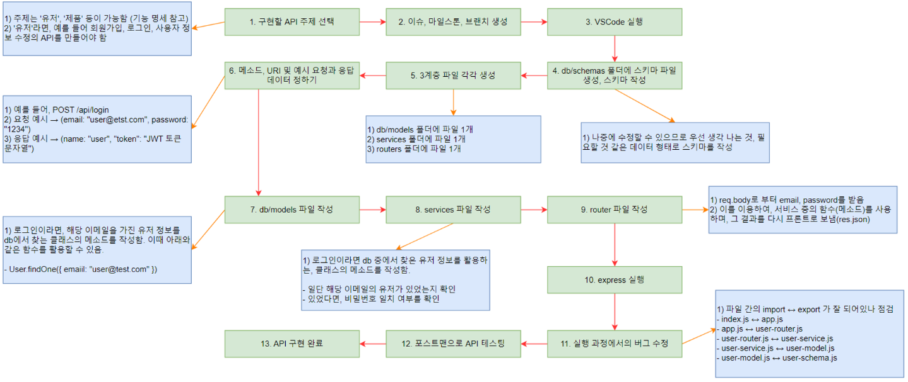

# 목차(Index)
- [기술 스택(Technology Stack)](#기술-스택technology-stack)
- [개발 흐름(Development Flow)](#개발-흐름development-flow)
- [상세 개발 프로세스(Detailed Development Process)](#상세-개발-프로세스detailed-development-process)
- [요구사항 정의(Requirement)](#요구사항-정의requirement)
- [일정(Schedule)](#일정schedule)
- [브랜치 전략(Branch Strategy)](#브랜치-전략branch-strategy)

<br>

# 기술 스택(Technology Stack)
- 언어
    - Javascript
- 프론트엔드
    - Bulma CSS
- 백엔드
    - Node.js
    - Express.js
    - Babel
    - MongoDB
- 배포
    - NginX, PM2, GCP

<br>

# 개발 흐름(Development Flow)
- ① 개발하고자 하는 서비스의 목적(Goal)과 목표(Objective)를 정의
    ```
    - 목적
        - 의류 상품을 빠르고 쉽게 구매 및 판매 가능한 온라인 쇼핑몰 서비스를 구현
    - 목표
        - 홈 화면에서 의류 상품 종류를 확인 가능
        - 회원 가입을 하지 않아도 상품을 구경하고 장바구니에 넣기 가능
        - 최소한의 클릭으로 상품을 구매하거나 판매 가능
    ```
- ② 서비스를 이용하는 대상(페르소나)을 정의
    ```
    소비자 : 체셔 (26) “옷을 살 시간이 없어서 온라인으로 구매 필요”
    직업 : 대학원생
    거주 : 부산에서 홀로 자취중
    캐릭터: 학업에 열중
    ```
- ③ 상세 기능을 명세
    ```
    - 사용자 관련 기능
    - 상품 관련 기능
    - 장바구니 관련 기능
    - 주문 관련 기능
    ```
- ④ 개발 시작

<br>

# 상세 개발 프로세스(Detailed Development Process)
- 개요
      
- 프론트엔드
      
- 백엔드
      

<br>

# 요구사항 정의(Requirement)
- 사용자(User)
    - 회원가입(create)
        - 회원가입 폼의 입력값이 조건에 부합 시 사용자에게 알려주는 기능
        - 조건에 맞게 입력 후 제출 시 백엔드 서버와 연결되어 회원가입 정보가 DB에 저장
    - 사용자 정보
        - 조회(read) : 사용자는 개인 페이지에서 본인의 회원 정보를 조회 가능
        - 수정(update) : 사용자는 개인 페이지에서 본인의 회원 정보를 수정 가능
        - 삭제(delete) : 사용자는 개인 페이지에서 본인의 회원 정보를 삭제 가능
        - DB : 사용자 이메일 / 이름 / 비밀번호(해싱 처리) / 주소
    - 로그인 기능
        - 로그인 폼의 입력값이 조건에 부합 시 사용자에게 알려주는 기능
        - DB에 저장된 정보로 로그인 성공 시 JWT 토큰이 프론트 단에 저장되며 다른 페이지(랜딩페이지, 상품페이지 등)로 이동
        - 로그아웃 시 프론트 단에 저장된 JWT 토큰 삭제
    - 관리자(Admin)
        - 관리자 계정이 존재하며 일반 계정과 구분
- 상품(Product)
    - 카테고리
        - 추가(create)
            - 관리자는 관리자 페이지에서 상품의 카테고리를 추가 가능
        - 조회(read)
            - 사용자는 카테고리 전체 목록을 화면에서 확인 가능
        - 수정(update)
            - 관리자는 관리자 페이지에서 상품의 카테고리를 수정 가능
        - 삭제(delete)
            - 관리자는 관리자 페이지에서 상품의 카테고리를 삭제 가능
    - 상품 데이터
        - 추가(create)
            - 관리자는 관리자 페이지에서 상품을 추가 가능
        - 조회(read)
            - 전체 목록(readAll) : 사용자는 상품 페이지에 진입 시 전체 목록을 조회 가능
            - 카테고리 필터(Filtering) : 사용자는 특정 카테고리를 선택 시 해당 카테고리에 대한 상품 목록을 조회 가능
            - 상세 목록(readOne) : 사용자는 특정 상품을 선택 시 해당 상품에 대한 상세 정보를 조회 가능
        - 수정(Update)
            - 관리자는 관리자 페이지에서 상품을 수정 가능
        - 삭제(Delete)
            - 관리자는 관리자 페이지에서 상품을 삭제 가능
        - DB
            - 상품명 / 가격 / 설명 / 제조사
            - 상품은 반드시 특정 카테고리에 소속(Not Null)
- 장바구니(Shopping List)
    - 데이터 관리
        - 장바구니 데이터는 백엔드의 DB가 아닌 프론트 단(localStorage, sessionStorage, indexedDB 등)에서 관리
        - 프론트 단에 장바구니 관련 데이터가 존재하므로 페이지를 새로고침해도 장바구니에 상품 데이터가 유지
    - 추가(create)
        - 사용자는 장바구니에 선택한 상품을 추가 가능
    - 조회(read)
        - 전체 목록(readAll) : 사용자는 장바구니에서 선택한 상품의 전체 목록을 조회 가능
        - 가격 조회 : 사용자는 장바구니에서 선택한 상품의 총 가격을 조회 가능
    - 수정(update)
        - 사용자는 장바구니에서 상품의 수량을 수정 가능
    - 삭제(delete)
        - 전체 삭제(deleteAll) : 사용자는 장바구니에서 특정 버튼(전체 삭제)을 1번 클릭 시 장바구니의 전체 목록을 삭제 가능
        - 부분 삭제(deleteOne) : 사용자는 장바구니에서 일부 상품을 선택하여 삭제 가능
- 주문(Order)
    - 추가(create)
        - 사용자는 장바구니에 속한 상품의 수량을 변경 가능(해석 필요)
        - 주문 완료 시 주문 완료 페이지로 이동
    - 조회(read)
        - 사용자는 개인 페이지에서 본인의 주문 내역을 조회 가능
        - 관리자는 관리자 페이지에서 사용자의 주문 내역을 조회 가능
    - 수정(update)
        - 사용자는 주문 완료 후 배송이 시작되기 전까지 주문 정보를 수정 가능(배송 상태가 변경 시 수정 불가)
        - 관리자는 사용자의 주문 내역에서 배송 상태를 수정 가능
    - 삭제(delete)
        - 사용자는 개인 페이지에서 본인의 주문 내역을 삭제 가능
        - 관리자는 관리자 페이지에서 사용자들의 주문 내역을 삭제 가능
    - DB
        - 배송지 정보 / 주문 총액 / 수령자 이름 / 연락처 / 배송 상태
- 주의사항
    - 회원 가입을 하지 않아도 서비스를 이용 가능
        - 서비스의 주 목적은 회원 가입이 아닌 쇼핑몰
        - 회원 가입 기능의 구현이 어려우면 과감히 제거
    - 미리 프로젝트 사이트의 가입된 회원 아이디 및 비밀번호를 README에 공유
        - 데모 발표를 진행하거나 다른 팀의 서비스의 원활한 테스트 목적
        - 복잡한 회원 가입 절차로 인해 다른 주요 기능이 가려지지 않도록 하기
    - 프로젝트 기간이 짧은 것을 염두하기
        - 프로젝트 기간 : 2주
        - 큰 목표(SNS 만들기 등)를 계획하기보다는 작은 기능(파일 업로드 기능, 좋아요 기능 등) 단위로 하나씩 추가 및 개선
    - 아이디어 고려
        - 물건을 주문하여 배송 가능한 쇼핑몰의 형태로 제작
        - 호텔 예약과 같은 서비스 기획은 최대한 지양

<br>

# 일정(Schedule)
## [Step 1] 개발 환경 구성 및 배포 시작 - 2/21(수)까지
```
[개요]
- VM에서 서버의 배포를 시작
- VM에서 배포에 필요한 모듈 및 패키지를 설치
- 배포 과정에서 문제가 없을 시 개발 시작

[공통]
- VM에서 Master branch를 배포 시작
- 개발에 필요한 툴 설치 및 개발 환경을 세팅
- 개발 내용을 병합할 dev branch를 생성
```

## [Step 2] 상품 관련 기능, 장바구니 기능 MVP 구현 - 2/23(금)까지
```
[개요]
- 우선순위가 높은 상품 관련 기능과 장바구니 기능부터 개발 시작
- 각 개발이 완료되면 dev branch에 개발한 내용을 병합
- 개발이 완료 시 VM에서 배포를 테스트하며 예외 처리 등을 확인

[공통]
- 각 MVP의 개발과 관련된 이슈 및 마일스톤 세팅
- 개발한 내용을 틈틈이 dev 브랜치에 merge
- 개발한 내용을 실제 VM에 배포하여 테스트를 진행 및 오류 수정
- 두 MVP(상품 관련 기능 / 장바구니 기능)를 완성 시 2/23(금) 자정까지 master branch에 코치님께서 리뷰할 MR(Merge Request)를 작성
- 계획한 일정보다 빠를 경우 다른 MVP도 구현 시작

[프론트엔드]
- 기획안을 토대로 UI를 구현
- 앱을 실행하여 실제 동작을 확인
- API 문서를 참고하여 UI에 API를 연결
- API 서버가 출력하는 결과가 UI에 모두 반영되는지 테스트
- 기획 또는 의도한 내용과 같이 기능이 동작하는지 확인

[백엔드]
- 각 기능에 필요한 API를 개발
- 개발이 완료된 API는 문서를 작성하여 프론트엔드 담당자에게 전달
- 다양한 값을 입력해도 API 서버가 동작을 멈추는 일이 없도록 상세하게 예외처리
```
- MVP(Minimum Viable Product)
    - 구현하려는 제품의 핵심 가치를 선택하여 최소한의 기능만을 담아낸 제품
- 마일스톤(MileStone)
    - 프로젝트 단계별로 준수할 주요 일정을 나타내는 일정표

## [Step 3] 코드리뷰 결과 반영 - 2/26(월)까지
```
[개요]
- [STEP 2]에서 진행된 코치님의 코드리뷰 피드백을 반영
- MR이 거절 시 수정하여 다시 MR을 생성하고 master branch에 병합

[공통]
- MR이 거절 시, 빠르게 피드백 내용을 수정하여 MR을 다시 생성
- MR이 승인 시, 피드백 내용은 dev branch에 반영하고 다음 단계를 진행
```

## [Step 4] 나머지 MVP 구현 - 2/29(목)까지
```
[개요]
- [Step 2]에 이어 회원 가입 기능 및 주문 기능을 개발
- 개발이 완료 시 dev branch에 개발한 내용을 병합 및 VM에서 배포하여 예외처리 등을 확인

[공통]
- 이전 코드 리뷰에서 피드백 받은 문제점이 재발했는지 확인
- 모든 MVP 개발이 완료 시 VM에 배포하여 테스트를 진행
- 기능이 모두 동작하는 것을 확인 시 다음 단계를 진행
- 일정보다 빠르게 모든 MVP를 개발한 팀은 자신의 팀만의 기능을 추가하거나 UI를 바꾸는 등의 추가 기능을 구현

[프론트엔드]
- 기획안을 토대로 UI를 구현
- 앱을 실행하여 실제 동작을 확인
- API 문서를 참고하여 UI에 API를 연결
- API 서버가 출력하는 결과가 UI에 모두 반영되는지 테스트
- 기획 또는 의도한 내용과 같이 기능이 동작하는지 확인

[백엔드]
- 각 기능에 필요한 API를 개발
- 개발이 완료된 API는 문서를 작성하여 프론트엔드 담당자에게 전달
- 다양한 값을 입력해도 API 서버가 동작을 멈추는 일이 없도록 상세하게 예외처리
```

## [Step 5] 자동 배포 구성 및 발표 준비 - 3/1(금)까지

```
[개요]
- 해당 단계까지 완료 시 모든 필수 MVP가 VM에서 배포 중인 상태이며 서비스의 테스트와 시연에 문제 X
모든 개발이 완료 시 MR을 작성하고 부족한 문서를 보충하며 최종 발표를 준비

[공통]
- README.md 등 아직 작성하지 못한 문서가 있다면 작성하고 완료 시 코치님께서 리뷰할 MR 작성
- 이번에 작성할 MR은 3/2(토) 최종 발표 이후에 리뷰 예정이므로 최종 발표는 우선 dev branch로 진행
- VM을 재부팅 시 서비스가 자동으로 배포되도록 설정(선택)
```

## [Step 6] 최종 발표 후 코드 리뷰 - 3/2(토)까지
```
[개요]
- 2주동안 개발한 내용을 발표
- 이전 단계에서 생성한 MR은 3/2(토) 자정까지 수락 될 예정
- VM이 종료 시 접근이 불가능하므로 필요한 데이터가 있다면 미리 백업

[공통]
- 지금까지 개발한 내용이 master 브랜치에 병합된 것을 확인되면 첫 번째 프로젝트의 모든 과정이 완료
```

<br>

# 브랜치 전략(Branch Strategy)
## 전략 개요
  
- 프론트엔드와 백엔드를 나눠서 브랜치를 관리
- 프론트엔드와 백엔드가 사용하는 폴더를 따로 관리 시 conflict가 발생하지 않도록 개발 가능
- 브랜치명 분리
    - feature-FE(프론트엔드) / feature-BE(백엔드)

## 사용하는 branch 종류
- 사용 O
    - master(main)
        - 바로 product로 release(배포)할 수 있는 branch
    - dev(develop)
        - product로 release할 준비가 된 가장 안정적인 branch로 개발이 완료된 상태라면 master branch로 merge
    - feature 
        - 새로운 기능을 추가할 때 사용하는 branch로 dev branch에서 분기하여 진행
        - 개발이 완료된 기능은 dev branch로 merge
- 사용 X
    - release: 
        - dev branch에 release할 때 생성하는 branch
        - dev branch에서 분기하여 진행되며 완료된 경우 dev branch와 master branch로 merge
    - hotfix
        - release된 product에서 발생한 버그를 수정할 때 사용하는 branch
        - master branch에서 분기하여 진행되며 dev와 master branch로 merge

## branch 사용 흐름 예시
  

<br>