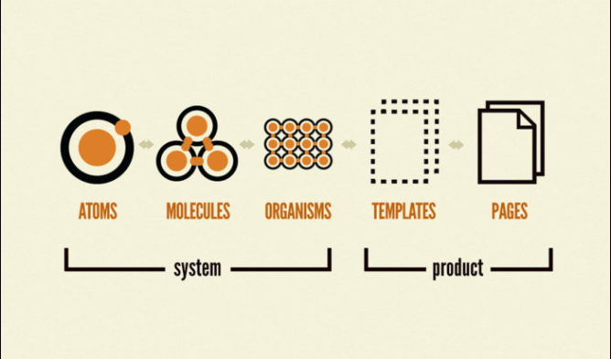

# 역할
```html
<!-- Before -->
<p style="color: #f00; font-size: 18px;">이 텍스트는 18px의 빨간 문자로 표시됩니다</p>

<!-- After -->

<!-- HTML -->
<p>이 텍스트는 18px의 빨간 문자로 표시됩니다</p>

<!-- CSS -->
p {
    color: #f00;
    font-size: 18px;
}
```
- HTML 또는 XML의 각 요소를 꾸미는 것
- 문서의 구조(HTML, XML)와 스타일(디자인)을 분리

# 문제점
- 변경이 불가능한 HTML / CSS의 결합
    - export한 HTML 또는 CSS는 변경이 거의 불가능하므로 구조를 변경하고 싶어도 어쩔 수 없이 사용하는 경우 多
- 늘어나는 페이지 수
    - 페이지 수가 늘어남에 따라 CSS가 점점 복잡해지기 관리가 어려움
    - CSS가 전역 범위이므로 발생하는 문제
    - 전역 범위 : 모든 스타일링이 서로 간섭할 가능성이 있는 상태
- 빈번하게 변경되는 상태
    - 자바스크립트가 웹사이트 내 애니메이션이나 인터랙션을 담당하면서 스타일링만하는 CSS 개발 방식이 한계에 도달
    - 브라우저의 성능이 향상되면서 브라우저 내에서 동작하는 웹 앱(페이스북, 트위터 등)에서도 많은 상태 변경(사용자가 로그인 중인지, 새로운 메시지가 있는지 등)이 발생

# 해결책 - CSS 설계
- 종류
    - BEM
    - SMACSS
    - OOCSS
    - SUIT CSS / NCS / Systematic CSS / FLOCSS / PRECSS / ...
- 많은 CSS 설계 방식의 공통점
    - 추상화
        - 다른 스타일 사이에서 공통화할 수 있는 부분이 있는가?
        - 공통된 부분을 추출하여 하나로 모을 수 있는가?
    - 분리
        - 파일로 분리
        - 부품 크기로 분리
        - 역할에 따라 이름을 분리

# Atomic Design Pattern

- Atoms(원자)
    - 가장 작은 단위가 되는 모듈
    - 버튼, 입력 필드, 제목 등
    - 더 이상 분리할 수 없을 정도로 작은 UI
- Molecules(분자)
    - Atoms(원자)가 모여 그룹을 형성하여 하나의 모듈이 된 것
    - 검색 폼 등
- Organisms(유기체)
    - 분자뿐만 아니라 원자와 다른 유기체를 포함 가능
    - Header, Footer 등
- Templates(템플릿)
    - Atoms(원자), Molecules(분자), Organisms(유기체) 등의 요소들을 조합하여 만든 레이아웃
    - 실제 사용하는 이미지나 텍스트 등의 컨텐츠는 고려하지 않은 상태에서 레이아웃이나 구조를 정의한 것
- Pages(페이지)
    - Templates(템플릿)에서 실제 이미지나 텍스트 등의 컨텐츠를 적용하여 완성된 웹페이지 형태
    - 같은 레이아웃일지라도 컨텐츠가 다른 경우가 존재할 수 있으므로 Templates(템플릿)과 Pages(페이지)를 분리

