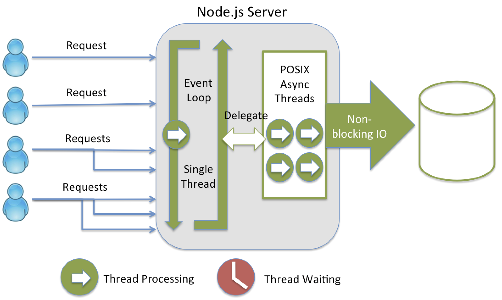
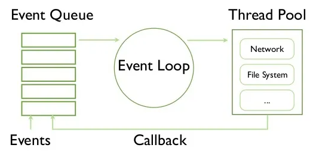

# 1. Node.JS 개요
## 1-1. What is Node.JS?
  
- Chrome V8 JS 엔진으로 빌드된 자바스크립트 런타임 환경(Runtime Environment)
    - Runtime : 특정 언어로 만든 프로그램을 실행할 수 있는 환경
- 주로 서버 사이드 애플리케이션 개발에 사용되는 소프트웨어 플랫폼
- 자바스크립트를 어느 환경에서나 실행할 수 있도록 하는 실행기

## 1-2. 등장배경
- 단방향 통신 위주의 Web 1.0에서 사용자와의 상호작용이 빈번한 Web 2.0으로 발전 
- V8 엔진의 등장
    - 구글에서 개발한 오픈소스 자바스크립트 엔진
    - JIT(just-in-time) 컴파일러를 사용하여 코드를 실행
- 기존의 자바스크립트 프로그램은 웹 브라우저 내에서만 실행 가능
    - 브라우저 외의 다른 환경에서 자바스크립트를 실행하려는 시도가 있었으나 자바스크립트의 실행 속도 문제로 인해 불가
    - v8 엔진의 등장으로 고성능의 JS를 실행 가능하게 되어 JS를 브라우저 외부에서 사용 가능 → Node JS의 등장
- Browser의 JS VS Node.js
    |Browser의 JS|Node.js|
    |:---:|:---:|
    |브라우저에서 실행|크로스 플랫폼 실행|
    |웹 내부의 제한된 동작|제한 없이 동작|
    |웹 프론트 위주 개발|다양한 어플리케이션 개발|
- Node JS와 Spring Framework 속도적인 측면에서 차이가 나는 이유
    ```
    1. Node는 I/O 작업에 완전한 비동기 처리를 지원
    - 요청을 비동기로 받는 것까지는 동일
    - 하나의 요청 처리 과정 내에서 필요할 경우 비동기로 작업을 위임
    - 작업을 위임하기 때문에 대기 없이 다른 작업을 수행 가능하여 대기 시간이 매우 적거나 없음

    2. Spring은 요청 처리를 하는 부분에서 블로킹 방식으로 수행
    - I/O 작업과 같이 시간과 리소스를 필요로 하는 작업을 수행 시 요청 처리를 위해 할당받은 쓰레드가 대기
    - 요청을 받는 것은 비동기 방식이지만 언어의 특성으로 인해 요청의 처리는 블로킹 방식으로 수행
    - 요청이 많을 수록 쓰레드의 수가 많아지므로 컨텍스트 스위칭으로 인해 오버헤드 현상이 나타남에 따라 성능 차이가 발생
    ```

## 1-3. 주요 특징
### 1-3-1. 싱글 쓰레드(Single Thread)
  
- 하나의 쓰레드가 주어진 작업을 하나 씩 처리하는 방식
- 싱글 쓰레드인 상황에서 성능(작업 처리 효율)을 극대화하기 위해 비동기(Non-Blocking & asynchronous) 처리 방식을 채택  
    ```
    Node JS는 싱글 쓰레드 기반의 비동기 이벤트 루프를 사용하므로 빠르다?
    - 싱글 쓰레드인 메인 스택에서 로직을 처리하며 비동기 작업은 쓰레드 풀에서 멀티 쓰레드로 처리

    위와 같은 방식인데도 싱글 쓰레드라 하는 이유?
    - Node를 실행 시 생성되는 프로세스 자체는 멀티 쓰레드
    - 이벤트 루프에서 메인 처리 스택인 호출 스택이 1개이므로 직접 제어 가능한 쓰레드는 1개이므로 싱글 쓰레드로 지칭
    ```
- Node가 싱글 쓰레드로 동작하지 않는 경우
    ```
    1. Thread Pool
    - Node가 암호화, 파일 입출력, 압축 등의 특정 동작을 수행 시 스스로 멀티 쓰레드를 사용

    2. Worker Thread
    - Node에서 멀티 쓰레드를 사용할 수 있게 된 기능
    - 직접 다수의 쓰레드를 제어 가능
    - CPU 작업이 많은 경우에 주로 사용 
    ```
- 싱글 쓰레드의 장단점
    ```
    1. 장점
    - 쓰레드가 늘어나지 않으므로 효율적인 리소스 관리 가능
    - 경쟁 상태 및 교착 상태 X

    2. 단점
    - 쓰레드 기반의 작업(CPU 연산 등) 처리의 효율성 ↓

    3. 싱글 쓰레드 방식의 효율성이 높으려면
    - 다중 처리를 동시에 처리할 필요성 존재
    - 많은 I/O 작업을 수행
    - 단순한 CPU 작업만을 수행
    ```

### 1-3-2. 논 블로킹 I/O 모델(Non-Blocking I/O Model)
  
- 작업 시간이 긴 함수를 백그라운드로 보낸 후 다음 코드를 먼저 실행하며 이후 오래 걸리는 함수를 실행
- Non-Blocking : 하나의 작업을 실행 후 해당 작업이 종료되지 않아도 다음 작업을 실행하는 방식
- Blocking은 이전 작업이 반드시 완료되어야 다음 작업을 수행하는 것이므로 호출 스택(Call Stack)이 멈춘 상태
- JS는 논 블로킹(Non-Blocking) + 비동기(asynchronous) 방식을 지원
    ```
    비동기(asynchronous) == 논 블로킹(Non-Blocking)?
    - JS에서는 비동기와 논 블로킹을 혼용
    
    동기 VS 비동기 → 작업의 시간 흐름 + 질서/순서 관점
    Blocking VS Non-Blocking → 작업을 하는 작업자(Thread)의 관점
    ```

### 1-3-3. 이벤트 기반(Event-Driven)
  
- 이벤트가 발생할 때 미리 지정해둔 작업을 수행하는 방식
- 이벤트 리스너에 콜백 함수를 등록하여 특정 이벤트가 발생 시 무엇을 할지 미리 설정 가능
- 여러 이벤트가 발생 시 어떤 순서로 콜백 함수를 호출할지 이벤트 루프(Event Loop)가 판단
    ```
    이벤트 루프(Event Loop)
    - 이벤트 발생 시 호출할 콜백 함수를 관리
    - 호출된 콜백 함수의 실행 순서를 결정
    - 노드가 실행이 종료될 때까지 이벤트 처리를 위한 작업을 반복(loop)
    - 이벤트 루프가 없을 경우 JS 코드는 동기 방식으로만 실행 가능
    ```
- Node는 JS 코드의 맨 위부터 한 줄씩 실행
    - 함수 호출 부분을 발견 시 호출한 함수를 호출 스택(call stack)에 넣고 다음 코드를 확인하며 호출 스택이 누적
    - 함수는 실행되는 동안 호출 스택에 머무르며 실행이 완료 시 호출 스택에서 삭제
    - 컨텍스트(함수가 호출되었을 때 실행되는 환경)까지 모두 실행이 완료 시 호출 스택 내의 모든 요소는 잔여 X

# JS 환경에서 작업의 효율성 증가시키기
- 작업 자동화를 위한 Script성 코드가 아닌 이상 async API를 사용
    - Script성 코드는 단발성이며 보통 하위 작업을 순차적으로 수행하므로 성능의 중요성 ↓
    - 이외의 코드(서버, UI 등)의 경우 반영구적이고 지속적으로 실행되는 코드이므로 성능의 중요성 ↑
    - 작업의 처리 능력(throughput)을 높이기 위해 async API를 활용
- CPU intensive한 코드(함수) 피하기
    - 필수적으로 작성이 필요한 코드일 경우 worker thread를 사용
- 상호 독립적인 비동기 함수의 경우 동시에 실행시키기
    - 하나씩 순차적으로 실행할 경우 처리 능력이 현저히 감소
    - async/await 문법을 사용하는 초보자의 코드에서 자주 발생하는 문제
    - 항상 비동기 함수를 다룰 시 작업 실행의 효율을 생각할 것(병렬적 관점)
- 동시에 실행시킨 비동기 함수의 결과물을 한 곳에 모아 처리하려면 Promise.all을 사용

# Reference
- [참조 1](https://poiemaweb.com/nodejs-basics)
- [참조 2](https://velog.io/@ahsy92/%EA%B8%B0%EC%88%A0%EB%A9%B4%EC%A0%91-JavaScript-%EB%9F%B0%ED%83%80%EC%9E%84-%EC%9E%91%EB%8F%99%EB%B0%A9%EC%8B%9D-%EB%B9%84%EB%8F%99%EA%B8%B0%EC%99%80-%EC%9D%B4%EB%B2%A4%ED%8A%B8-%EB%A3%A8%ED%94%84)
- [참조 3](https://urmaru.com/8)
- [참조 4](https://velog.io/@tkppp-dev/%EC%99%9C-Node.js%EB%8A%94-%EC%9E%90%EB%B0%94%EB%B3%B4%EB%8B%A4-%EB%B9%A0%EB%A5%B8%EA%B0%80)
- [참조 5](https://blog.naver.com/dlaxodud2388/222218703957)
- [참조 6](https://blog.naver.com/pjt3591oo/221976414901)